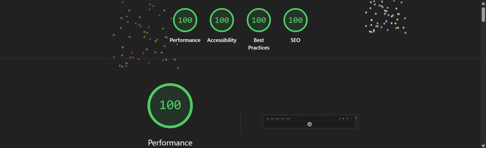

<!--
Muhammad Zain – Software Engineering Portfolio
-->

<a name="muhammad-zain-portfolio"></a>
<h1 align="center">🌐 Muhammad Zain – Software Engineering Portfolio</h1>

<div align="center">


<em><small>A production-ready portfolio built with Next.js and Tailwind CSS, focused on performance, accessibility, and maintainability.</small></em>

**Live site:** [muhammadzain.app](https://muhammadzain.app/)

</div>

---

### Table of Contents
- [Project Overview](#project-overview)
- [Features & Highlights](#features-and-highlights)
- [Tech Stack](#tech-stack)
- [Architecture](#architecture)
- [Performance & Optimization](#performance-and-optimization)
- [Deployment & Production](#deployment-and-production)
- [Development Process](#development-process)
- [Contributing](#contributing)
- [License](#license)
- [Contact](#contact)

---

<a name="project-overview"></a>
### Project Overview

<small>Personal portfolio for Muhammad Zain, Software Engineering student at the University of Calgary. The site presents professional background, selected projects, and technical interests, with an emphasis on performance, accessibility, and user experience. Deployed at [muhammadzain.app](https://muhammadzain.app/).</small>

<a name="features-and-highlights"></a>
### Features & Highlights

#### Core Features
- **Multi-page portfolio** with dedicated sections for home, about, projects, resume, and LeetCode
- **Interactive project showcase** with modal image and video previews, live demo links for deployed projects, PDF references, and detailed descriptions
- **Resume request form** that emails the resume PDF to visitors via a secure API endpoint
- **Contact system** with floating launcher and quick-copy actions for email and social links
- **Theme switching** with dark and light mode support and system preference detection

#### User Experience
- **Fully responsive design** optimized for mobile, tablet, and desktop viewports
- **Smooth animations** using Framer Motion with GPU-friendly transforms and opacity changes
- **Layout stability** through proper image sizing and reserved space for media
- **Faster navigation** via idle-time route prefetching with a custom `usePrefetch` hook
- **Accessible UI** with semantic HTML, ARIA labels, and keyboard-friendly controls

#### Technical Implementation
- **SEO optimization** with per-page meta tags, Open Graph, Twitter cards, and structured data (JSON-LD)
- **Web Vitals measurement** using the `web-vitals` library (ready for analytics if configured)
- **Security headers** including CSP, HSTS, and content type validation
- **Image optimization** via the Next.js Image component with a custom wrapper for consistent sizing
- **Code splitting** with dynamic imports for secondary UI components to reduce initial bundle size

<a name="tech-stack"></a>
### Tech Stack

#### Framework & Core
- **Next.js 15** (Pages Router) - React framework with SSG and SSR capabilities
- **React 18** - UI library with concurrent features
- **Tailwind CSS 3.x** - Utility-first CSS framework with custom theme configuration

#### Libraries & Tools
- **Framer Motion** - Animation library for smooth, performant transitions
- **next-themes** - Theme management with system preference detection
- **react-icons** - Icon library with consistent styling
- **nodemailer** - SMTP email delivery for resume requests and visit notifications
- **web-vitals** - Core Web Vitals measurement

#### Development & Build
- **ESLint** - Code linting with Next.js config
- **PostCSS** - CSS processing and optimization
- **Vercel** - Deployment platform with automatic builds

<a name="architecture"></a>
### Architecture

```
Zain Portfolio/
  README.md
  LICENSE
  Lighthouse-score.png
  zain-portfolio-next/
    public/                      # Static assets
      images/
        profile/                 # Profile image
        projects/                # Project preview images and videos
      Muhammad-Zain-Resume.pdf   # Resume file
      Lagrange.pdf               # Lumen Pendulum physics reference
      manifest.json              # PWA manifest
    src/
      components/                # Reusable UI components
        Layout.js                # App shell layout
        NavBar.js                # Desktop navigation
        BottomNavigation.js      # Mobile navigation
        Footer.js                # Site footer
        SEO.js                   # Per-page SEO management
        OptimizedImage.js        # Image wrapper with loading states
        ThemeSwitcher.js         # Dark/light theme toggle
        Contact.js               # Contact section wrapper
        ContactChat.js           # Floating contact launcher
        CircularText.js          # Rotating contact badge text
        MobileContact.js         # Mobile contact UI
        ResumeRequestForm.js     # Resume request form
        WebVitals.js             # Web Vitals measurement
      hooks/                     # Custom React hooks
        usePrefetch.js           # Route prefetching logic
        useSwipeGestures.js      # Mobile gesture handling
        usePullToRefresh.js      # Pull-to-refresh on mobile
      pages/                     # Next.js pages and API routes
        index.js                 # Home
        about.js                 # About
        projects.js              # Projects showcase
        resume.js                # Resume request form
        leetcode.js              # LeetCode profile
        api/notify-visit.js      # Visit notification endpoint
        api/send-resume.js       # Resume email endpoint
      styles/                    # Global styles and responsive design
    next.config.mjs              # Next.js configuration with security headers
    vercel.json                  # Vercel function config for resume PDF
    tailwind.config.js           # Tailwind theme and component configuration
```

<a name="performance-and-optimization"></a>
### Performance & Optimization

<small>A production Lighthouse audit of [muhammadzain.app](https://muhammadzain.app/) achieved 100/100 across all categories. Scores can vary by device, network, and Lighthouse version.</small>

#### Lighthouse Results (Production Audit)
- **Performance: 100/100** - Optimized LCP, FID, and CLS metrics
- **Accessibility: 100/100** - Semantic structure and accessible controls
- **Best Practices: 100/100** - Security headers, HTTPS, and modern standards
- **SEO: 100/100** - Meta tags, structured data, and crawlability



#### Optimization Techniques
- **LCP optimization** - Hero images use `priority` loading and avoid fade-in animations
- **JavaScript optimization** - Code splitting reduces initial bundle to essential components only
- **Image handling** - Responsive images with proper `sizes` attributes and WebP format
- **Animation performance** - GPU-accelerated transforms avoid layout thrashing
- **Prefetching strategy** - Routes prefetch during idle time for faster navigation
- **Tree shaking** - Unused code is eliminated in production builds

<a name="deployment-and-production"></a>
### Deployment & Production

<small>**Platform:** Vercel with automatic deployments from the `main` branch · **Live URL:** [muhammadzain.app](https://muhammadzain.app/)</small>

<small>**Build Process:**
- Development builds include HMR, React refresh, and debugging tools
- Production builds enable minification, tree-shaking, and static optimization
- Automatic image optimization and WebP conversion during build
- SMTP credentials configured via Vercel environment variables for email features</small>

<small>**Runtime Notes:**
- Web Vitals are measured client-side and can be forwarded to analytics if configured
- Visit notifications and resume emails are sent through Nodemailer over SMTP
- Manual Lighthouse audits are used to validate production performance</small>

<a name="development-process"></a>
### Development Process

<small>The portfolio was developed iteratively with a focus on production-quality performance, accessibility, and maintainable code.</small>

#### Development Approach
- **Performance-first design** - Every feature evaluated for impact on Core Web Vitals
- **Mobile-first responsive design** - Built for mobile with progressive enhancement
- **Accessibility integration** - WCAG guidelines followed from initial design phase
- **Cross-browser testing** - Verified compatibility across modern browsers and devices

#### Key Implementation Details
- **SEO strategy** - Structured data, meta tags, and Open Graph for search and social sharing
- **Security implementation** - CSP headers, input validation, and secure deployment practices
- **Code organization** - Component-based architecture with clear separation of concerns
- **Email workflows** - Resume delivery and visit notifications via SMTP

#### Quality Assurance
- Manual testing across desktop, tablet, and mobile viewports
- Lighthouse audits on the production deployment
- Accessibility checks with keyboard navigation and semantic markup
- Ongoing review for maintainability and performance regressions

<a name="contributing"></a>
### Contributing

<small>This is a personal portfolio project. Suggestions and improvements are welcome via issues or direct contact.</small>

<a name="license"></a>
### License

<small>MIT License © 2026 Muhammad Zain</small>

<a name="contact"></a>
### Contact

- **Project Maintainer:** Muhammad Zain
- **Website:** [muhammadzain.app](https://muhammadzain.app/)
- **Email:** muhammadzain0476@gmail.com

<div align="center">

<small>Built with Next.js, Tailwind CSS, and Framer Motion.</small>

[Back to Top](#muhammad-zain-portfolio)

</div>
