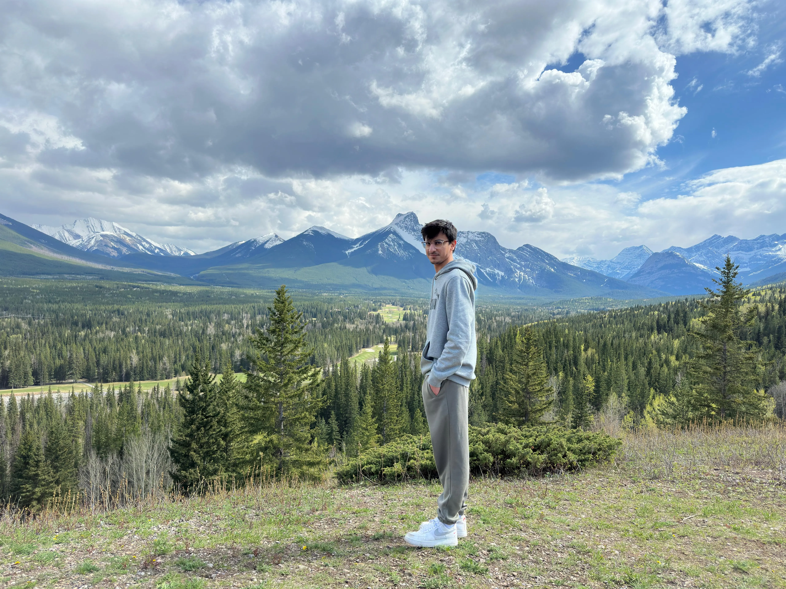

<!--
Masterclass README for Muhammad Zain – Portfolio
-->

<a name="muhammad-zain-portfolio"></a>
<h1 align="center">🌐 Muhammad Zain – Software Engineering Portfolio</h1>

<div align="center">


<em>A modern, fast, and accessible portfolio built with Next.js and Tailwind CSS.</em>

</div>

---

## 📋 Table of Contents
- [Project Overview](#project-overview)
- [Highlights](#highlights)
- [Screenshots](#screenshots)
- [Tech Stack](#tech-stack)
- [Architecture](#architecture)
- [Features](#features)
- [Performance and Accessibility](#performance-and-accessibility)
- [Development vs Production](#development-vs-production)
- [Getting Started](#getting-started)
- [Environment Variables](#environment-variables)
- [Deployment](#deployment)
- [Development Journey](#development-journey)
- [Testing and Quality](#testing-and-quality)
- [Contributing](#contributing)
- [License](#license)
- [Contact](#contact)

---

<a name="project-overview"></a>
## 🚀 Project Overview

This is my personal portfolio. It showcases my background as a Software Engineering student at the University of Calgary, along with a selection of projects and interests. The site is tuned for production performance, accessibility, and clean UX.

<a name="highlights"></a>
## ✨ Highlights

- 100/100 Lighthouse on all pages in production (Performance, Accessibility, Best Practices, SEO)
- Modern UI/UX with smooth, GPU-friendly animations
- Fully responsive (mobile → desktop) with zero layout shift (CLS)
- Per-page SEO, structured data, and careful head/CSP configuration

<a name="screenshots"></a>
## 🖼️ Screenshots

> Representative visuals from the live site.

| Hero / Profile | Projects Grid | Resume Viewer |
| --- | --- | --- |
|  |  |  |

<a name="tech-stack"></a>
## 🧰 Tech Stack

- Next.js 15 (Pages Router)
- React 18
- Tailwind CSS 3.x
- framer-motion (animations)
- next-themes (dark/light theme)
- react-icons (icons)
- web-vitals (silent metrics)

<a name="architecture"></a>
## 🏗 Architecture

```
Zain Portfolio/
  README.md
  LICENSE
  zain-portfolio-next/
    public/                      # static assets (images, video, pdf, manifest)
    src/
      components/                # UI components (NavBar, Footer, SEO, etc.)
      hooks/                     # custom hooks (e.g., usePrefetch)
      pages/
        _app.js                  # app wrapper: theme, layout, route animations
        _document.js             # custom document, critical head tweaks
        index.js                 # home page
        about.js                 # about page with skills timeline
        projects.js              # projects with modal media
        resume.js                # embedded resume viewer
        leetcode.js              # placeholder for journey
      styles/globals.css         # global styles
    next.config.mjs              # Next.js config + security headers
    tailwind.config.js           # Tailwind config
    package.json                 # scripts and dependencies
```

<a name="features"></a>
## 🔎 Features

- Per-page SEO via `src/components/SEO.js` (Open Graph, Twitter, canonical)
- Structured data (JSON-LD) in `pages/_document.js`
- Strict security headers and CSP in `next.config.mjs`
- Optimized images via `next/image` + a thin wrapper (`OptimizedImage`)
- Motion enhancements with framer-motion (compositor-friendly)
- Responsive layouts with Tailwind; mobile-first
- Web Vitals collection (silent) via `WebVitals`
- Idle-time route prefetching (`usePrefetch`) for instant navigation
- Floating "Contact" launcher with chat-like quick-copy actions
- Projects page with modal image/video preview
- Resume page with embedded PDF and download

<a name="performance-and-accessibility"></a>
## ⚡ Performance and Accessibility

- 100/100 across all Lighthouse categories in production
- LCP images use `priority` and avoid fade-in to prevent LCP delays
- Animations rely on transform/opacity for GPU compositing
- `sizes` and `fill` are used to prevent layout thrash and ensure proper responsive images
- Secondary UI (e.g., Contact) is code-split/dynamically imported to reduce initial JS
- Accessibility: semantic structure, contrast, keyboard-friendly, live regions for feedback

### Lighthouse (production)

The following score was captured from the production server.


<a name="development-vs-production"></a>
## 🧪 Development vs Production

- Dev adds HMR, react-refresh, websockets → expect lower Lighthouse in dev
- Prod removes dev overlays, minifies, and tree-shakes → target scores achieved
- Measure Lighthouse on: `npm run build && npm start`

<a name="getting-started"></a>
## 🛠 Getting Started

Prerequisites: Node 18+ recommended

```bash
cd zain-portfolio-next
npm ci
npm run dev
```

Production build:

```bash
npm run build
npm start
```

<a name="environment-variables"></a>
## 🔐 Environment Variables

Create a `.env.local` (not committed) for local development if needed.

- `NEXT_PUBLIC_SITE_URL` (recommended)
  - e.g., `https://muhammadzain.vercel.app` (or your custom domain)

<a name="deployment"></a>
## 🚢 Deployment

This site is deployed on Vercel.

<a name="development-journey"></a>
## 🛤 Development Journey

This project reflects several iterations of UI polish, performance tuning, and accessibility improvements. It was built with a strong emphasis on clean code, minimal layout shift, and excellent SEO.

**AI-Assisted Development** (Cursor AI / GPT-5) helped with:
- Performance tuning (Lighthouse targets, LCP/TBT tweaks)
- Accessibility and SEO auditing
- Code health improvements (CSP, header hygiene, prefetch correctness)
- Non-intrusive analytics hooks (web-vitals)

All changes were reviewed to ensure the final result matches my design and quality standards.

<a name="testing-and-quality"></a>
## ✅ Testing and Quality

- Manual testing across desktop and mobile viewports
- Lighthouse audits (desktop + mobile) in production
- Code review and refactoring passes for clarity and maintainability

<a name="contributing"></a>
## 🤝 Contributing

Suggestions and improvements are welcome.
1. Fork the repository
2. Create a feature branch
3. Make your changes
4. Open a pull request

Coding preferences:
- Keep code readable and consistent with existing patterns
- Favor semantic HTML and accessible interactions

<a name="license"></a>
## 📄 License

MIT License © 2025 Muhammad Zain

<a name="contact"></a>
## 📞 Contact

- Project Maintainer: Muhammad Zain
- Email: muhammadzain0476@gmail.com

<div align="center">

Made with passion using Cursor, Next.js, Tailwind CSS, and thoughtful attention to detail

[⬆ Back to Top](#muhammad-zain-portfolio)

</div>
